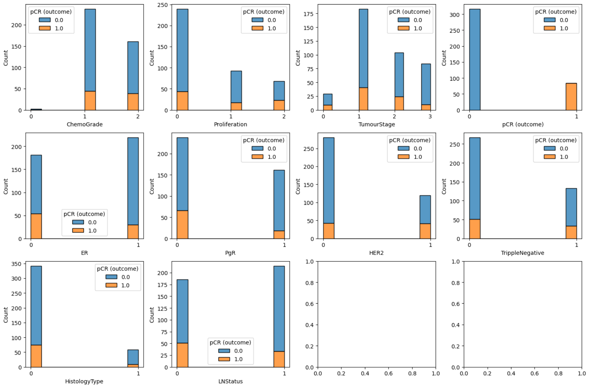
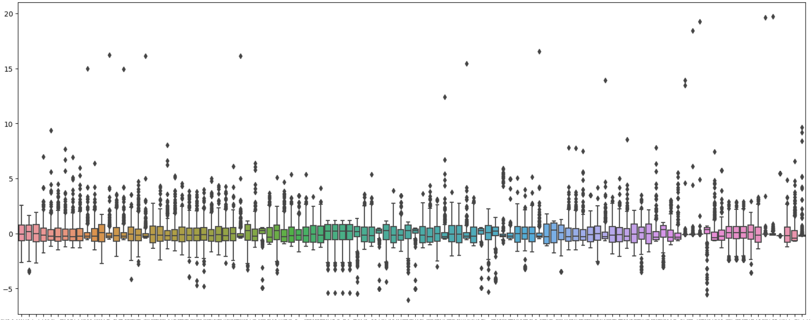
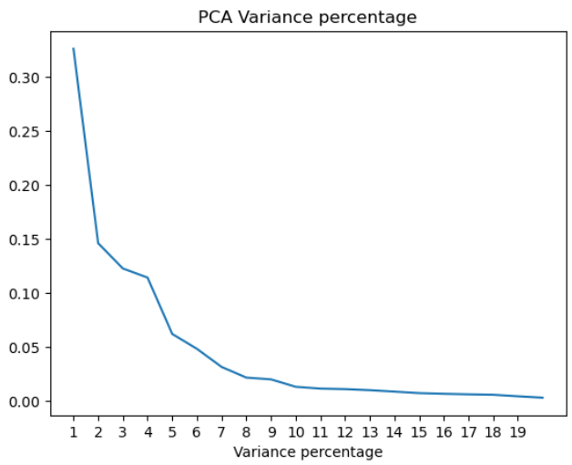

Predicting the pCR rate for breast cancer patients using machine learning techniques with both clinical features and radiomics features.

Skill set for this project:
- Python
- Scikit-learn
- Git

---

## Highlights

- Developed machine learning models using Python with **Scikit-learn**, **Pandas**, and **NumPy**, achieving a **30%** improvement in disease treatment response prediction
- Optimized model performance through feature reduction techniques like **PCA**
- Collaborated with a multidisciplinary team to deliver a data-driven approach for improved disease treatment
prediction

## Data
Our data contains 400 entities with both clinical features (like ER, PR, HER2 status) and radiomics features (like shape, intensity, and texture of the tumor). The target variable is the pCR rate (pathological complete response) for breast cancer patients. The dataset is imbalanced with 30% pCR rate and 70% non-pCR rate.

All clinical data (below explaination are in Chinese) (positive: 表示該指標對癌細胞有影響):
- ER (Estrogen Receptor)
    - 雌激素受體，影響癌細胞對激素療法的反應
- PgR (Progesterone Receptor)
    - 黃體酮受體，影響癌細胞對激素療法的反應
- HER2 (Human Epidermal Growth Factor Receptor 2)
    - 影響細胞增長和修復的受體蛋白
- Proliferation
    - 細胞增殖速率，指癌細胞的生長速度
- LNStatus (Lymph Node Status)
    - 淋巴結狀態，指癌症是否擴散到淋巴結
- ChemoGrade
    - 衡量腫瘤對化療的反應 (殘留腫瘤的細胞數量)
- TumourStage
    - 腫瘤分期，指腫瘤的大小和擴散程度 (T1 [mild]~T4 [severe])
- TrippleNegative
    - 辨別腫瘤是否為三陰性乳腺癌 (ER-, PgR-, HER2-)
    - 0: 非三陰性乳腺癌 / 1: 三陰性乳腺癌
    - 三陰性乳腺癌對激素療法無效，通常需要化療
- HistologyType
    - 0: 浸潤性導管癌（Invasive Ductal Carcinoma, IDC）
        - 通常對化療的反應較好，pCR率較高
    - 1: 浸潤性小葉癌（Invasive Lobular Carcinoma, ILC）
        - 通常對激素療法的反應較好，對化療的反應較差，pCR率較低

Based on the data description and Fig 1, we can extract following insights:
1. ChemoGrade is highly imbalanced with low amount for label 0 and high amount for label 1 and 2. Might not be a good feature for model.
2. HistologyType indicates two types of cancer. Although there is some difference in pCR rate for those two types, the difference is not significant. Also, the amount of data for ILC (1) is much less than IDC(0), which might not be a good feature for model.
3. TrippleNegative is dependent on ER, PgR, and HER2 status. Might be redundant with those features.

 
<figure>
  
  <figcaption><strong>Fig 1: Categorical feature distribution for pCR 0 and 1</strong></figcaption>
</figure>
 

## Preprocess
- Data Imputation
    - Impute missing values with mean (for continuous features) and most frequent (for categorical features)
- Label Encoding
    - Categorical labels are encoded with integer values
- Data Normalization (z-norm)
    - Make all the features on the same scale (box plot showing the value range for all features after normalization are in Fig 2)
- Resampling (Over-sampling (SMOTE), Under-sampling)

 
<figure>
  
  <figcaption><strong>Fig 2: Box plot for all features after normalization</strong></figcaption>
</figure>
 

## Feature Selection & Dimensionality Reduction

### PCA (Principal Component Analysis)
- Apply on radiomics features (contain information about the shape, intensity, and texture of the tumor) to reduce the dimensionality of the data while retaining as much variance as possible
- Reduce noice and redundancy in the radiomics data to improve the model performance

 
<figure>
  
  <figcaption><strong>Fig 3: PCA variance ratio line plot</strong></figcaption>
</figure>
 

Based on Fig 2, we can see that after 5 components, the variance ratio starts to converge, showing that the first 5 principal components explain more than 80% of the variance in the radiomics data. Therefore, we can reduce the dimensionality of the radiomics data (114 radiomics features originally) to 5 components.

### Statistical Feature Selection

Principal Components of radiomics features are combined with clinical features. Then, we perform statistical feature selection to select the most important features for the model training. Following statistical feature selection methods are used:
- **Chi2**: for <u>categorical</u> features to <u>categorical</u> target
- **ANOVA**: for <u>continuous</u> features to <u>categorical</u> target

Features with p-value < 0.05 are selected for the model training. Table 1 shows the selected features after statistical feature selection sorted with chi2 statistics and f-score.

> Note: 
> - chi2 statistics: represent the dependence between the feature and the target variable 
> - f-score: $\frac{\text{variace between group}}{\text{variance within group}}$. Higher f-score showing larger difference between means of the groups and smaller variance within the groups, represent good feature.

 

| feature       | f-score   | p-Value  |
| ------------- | --------- | -------- |
| HER2          | 12.539683 | 0.000398 |
| PgR           | 9.549126  | 0.002    |
| ER            | 7.037306  | 0.007983 |
| PCA 1         | 6.882885  | 0.009037 |
| Proliferation | 5.851584  | 0.015563 |
| LNStatus      | 4.015582  | 0.045082 |

**Table 1: Selected features (p-Value < 0.05) after statistical feature selection (sorted with chi2 statistics and f-score)**

 

Compare the feature selection result with insights in [data section](#data), we can see that ChemoGrade, TrippleNegative, and HistologyType are not selected as important features for the model training. This is consistent with our data analysis. The only difference is that TumourStage is not selected as important feature, which we regard as important in the data analysis section. This might be due to the small data size and the imbalance of the data.

## Model Training

### Resampling

To handle the imbalanced dataset, we apply resampling techniques, combining both undersampling and oversampling to make sure the model is trained on a balanced dataset. We use SMOTE for oversampling and RandomUnderSampler for undersampling. After resampling, the dataset contains 284 samples for each class.

### Ensemble Model
We train multiple models and compare with each other. The models we trained are:
- Logistic Regression
- Random Forest
- Gradient Boosting
- XGBoost
- SVM
- MLP
- Decision Tree
- KNN
- Naive Bayes

We use 5-fold cross-validation to evaluate the model performance with balanced accuracy. The model comparison table are shown in Table 2.

 

| model               | mean     | std      |
| --------------------| -------- | -------- |
| Logistic_Regression | 0.689858 | 0.095609 |
| SVM                 | 0.654256 | 0.097178 |
| MLP                 | 0.66287  | 0.077066 |
| desicion tree       | 0.645486 | 0.095841 |
| gradient_boosting   | 0.616034 | 0.073139 |
| KNN                 | 0.644719 | 0.071722 |
| random_forest       | 0.675235 | 0.089821 |
| naive_bayes         | 0.658053 | 0.092252 |
| xgb                 | 0.669069 | 0.082384 |

**Table 2: Model comparison table with balanced accuracy (mean and std) after resampling**

 

Top 5 models are selected for voting ensemble model. The voting ensemble model is trained with the top 5 models and the final prediction is made by soft voting. The voting ensemble model achieves a balanced accuracy of 0.69.
